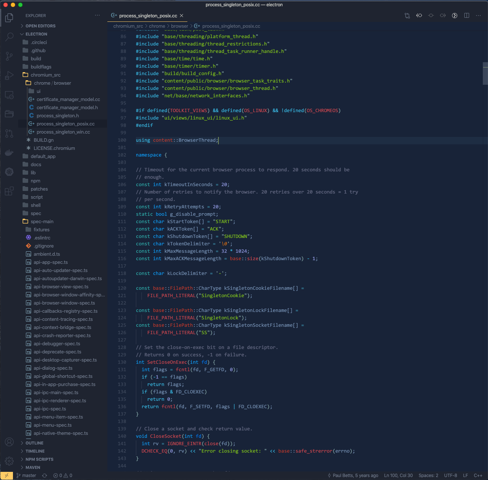

# Herb

A personal collection of themes. Themes work just like herbs: they wouldn't solve any practical problem, but they could make coding more enjoyable.

## Rosemary

Rosemary is a color theme for editors. It is built based on [Solarized Dark](https://ethanschoonover.com/solarized/), and the color tuning is done on [this website](http://tmtheme-editor.herokuapp.com/).



To install for Visual Studio Code:

```bash
cp -r rosemary $HOME/.vscode/extensions/
```

To install for Sublime Text:

```bash
# replace ${sublime_path_to_packages} to the path where sublime manages packages
cp rosemary/themes/rosemary.tmTheme ${sublime_path_to_packages}
```

## Thyme

Thyme is a theme for zsh. It is based on [bira](https://github.com/ohmyzsh/ohmyzsh/blob/master/themes/bira.zsh-theme), [gnzh](https://github.com/ohmyzsh/ohmyzsh/blob/master/themes/gnzh.zsh-theme), and [bullet-train](https://github.com/caiogondim/bullet-train.zsh/blob/master/bullet-train.zsh-theme).


Before install, make sure [oh-my-zsh](https://github.com/ohmyzsh/ohmyzsh) is installed.

```bash
cp thyme/thyme.zsh-theme $ZSH_CUSTOM/themes/
# then set ZSH_THEME to "thyme" in .zshrc
```

Thyme supports two options set via variables:

- if `THYME_USER_AS` is set, zsh will show `${THYME_USER_AS}` instead of user name.
- if `THYME_NO_HOST` is set to "true", zsh will hide host name. This can be useful on a personal computer, as the user usually know the host name very well and printing it can be redundant.
